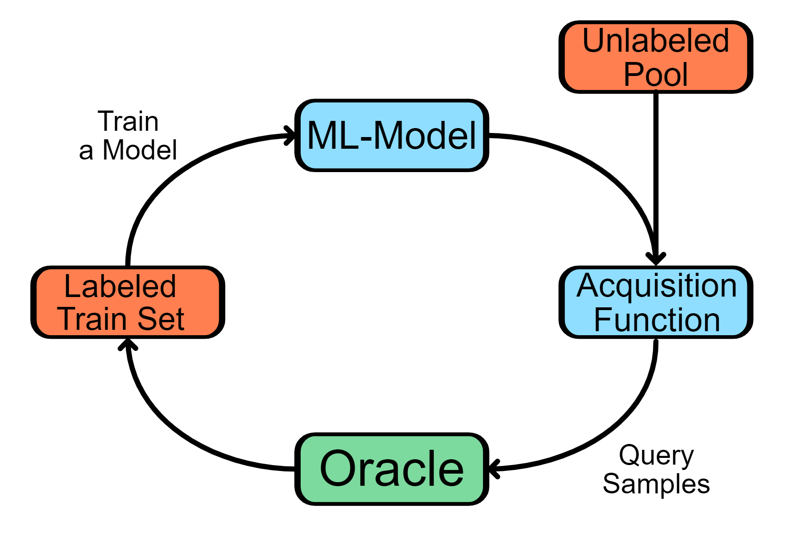
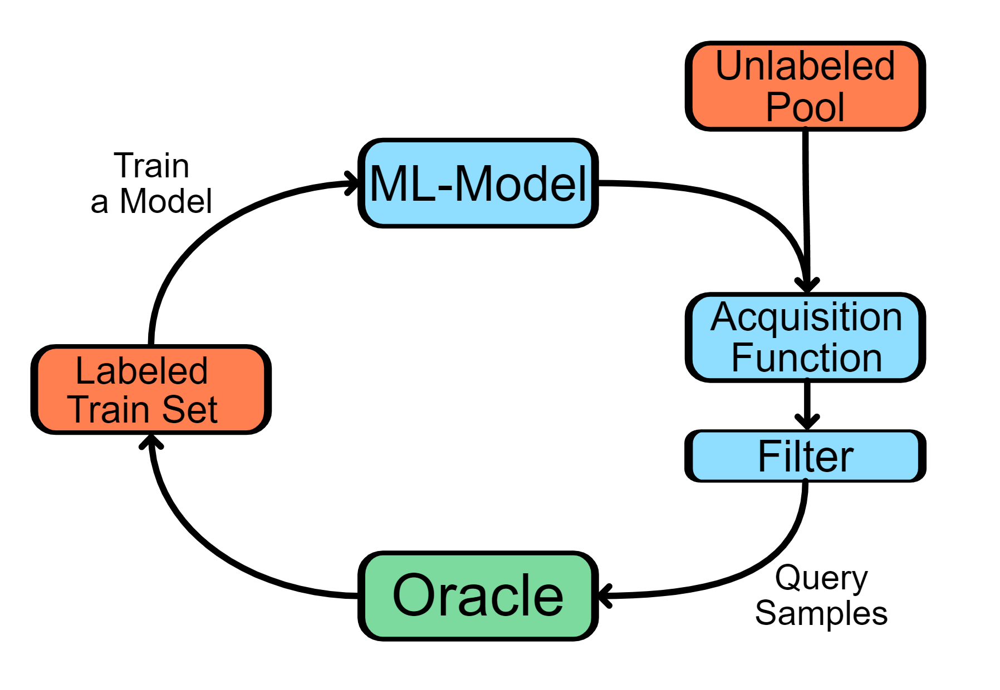

# Tense Oracle Project

The Tense Oracle Project contains the Code used in the Paper "...".
We publish the Code for reproducibility purposes. 
Here, we use a simple filter based approach to prevent Too Hard To Learn Samples (i.e. Outliers) 
from being labeled during Active Learning. 
As labels for such samples provide little value to Machine Learning algorithms and yet are often chosen
by Active Learning Algorithms as they aim to label samples on which the model currently perform the worst on. 
The idea is that the worse the model performs on a sample the more it can learn from it, 
this however does not hold true for outliers.

## Avoidance of Too Hard to Learn Samples during Active Learning - In a Nutshell

Active Learning (AL) is an approach to reduce the labeling costs of large datasets for machine learning (ML).
It does so by selecting the samples that are considered the most useful and then it only label those instead of all.
One of the most popular approaches to determine the usefulness of a sample is Pool-based Uncertainty Sampling.
For this a loop is employed. Where one starts with a small labeled dataset and a large unlabeled one.
Then a model is trained on the labeled dataset which makes predictions on the unlabeled dataset.
Usually this results in samples where the model is quite sure on the correct labeling and some, 
where it is unsure to which of multiple classes it belongs to. The samples where it is most uncertain about are chosen 
as the assumption is the worse the model performs on a sample the more it can learn from it.
The chosen samples are send to the Oracle (usually an human annotator) which labels the samples.
The newly labeled samples are added to the labeled data on which then a new model is trained and
the Loop repeats until a certain budget is used up.
The resulting dataset should then lead to better models than a dataset of similar size where samples were chosen at random to be labeled.

However, this approach fails on dataset with many Too Hard to Learn Samples (or Outliers). As on those the model regularly performs poorly. 
Hence, it selects those for labeling. 
However, it does not get better on them even when learning with them as those are too dissimilar from most other samples.
Therefore, one should avoid sampling those as AL would waste large amounts of resources on them without improving or even worsening the data set in tbe process.
Our approach to avoid those, is simply adding a filter which can veto some samples and keep them from being labeled.

## Usage
After Cloning the project one can run a trial via the following command:\
`python main.py --task_config Configs/Tasks/<task_config>.json --filter_strategy_name <filter_class_name>`

Note: Available Filters for `filter_class_name` can be found in the `Strategies` directory where the `__init__` file contains a listing of all available filters
Note: if there is no GPU available one needs to set the `--gpu_optional` flag else it's going to exit immediately as a GPU is highly recommended for most datasets

For Example:
`python main.py --task_config Configs/Tasks/dbpedia.json --filter_strategy_name AutoFilter_Chen_Like --gpu_optional`

Most Hyperparameter that should be kept constant between runs (to keep them comparable),
get specified in an extra config file that can be set via the `--experiment_config` argument by default it uses the `./Configs/standard.json` file
