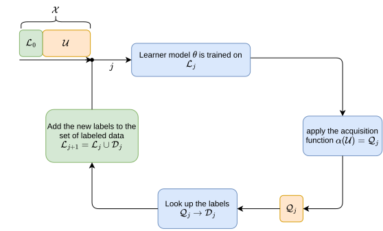
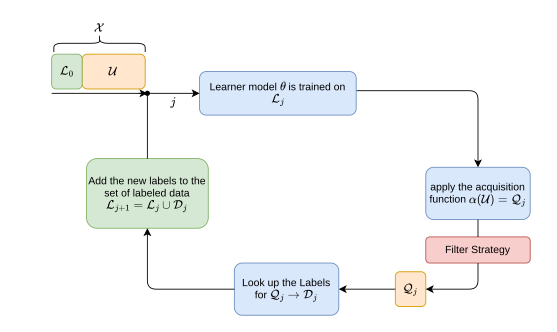

.. TenseOracle documentation master file, created by
   sphinx-quickstart on Sun Feb 23 15:23:04 2025.
   You can adapt this file completely to your liking, but it should at least
   contain the root `toctree` directive.

TenseOracle Documentation
=========================

.. rubric:: Introduction
This project contains the code utilized in the research paper "..."[\<cite>] and is made publicly available to ensure reproducibility.
In this project we motivate a filtering-based approach for mitigating the impact of 'Too Hard to Learn Samples' (i.e., outliers) during Active Learning (AL) training.

It has been shown [\<cite>], that outlier samples provide minimal value to machine learning algorithms, yet they are frequently chosen by AL strategies. AL strategies prioritize labeling instances where the model is currently performing the weakest.
The reason for that is, that the model assumes that it can gain the most information from samples on which it currently performs poorly compared to samples where the model is already performing well.
However, this assumption does not hold for outliers, as these samples often remain 'unlearnable' and thus lead to an inefficient allocation of labeling resources.

.. rubric:: Active Learning in a Nutshell
AL is a technique designed to reduce the cost of labeling large datasets for machine learning through selectively labeling only the most informative data samples.
One of the most widely used methods within AL is pool-based uncertainty sampling, which follows an iterative loop:

1. A small subset of labeled data and a large pool of unlabeled data are initialized.
2. A model is trained on the labeled data and then the trained model is used to make predictions on the unlabeled pool.
3. Samples for which the model has the highest uncertainty are chosen, based on the assumption that the model can learn the most from them.
4. These chosen samples are then sent to an oracle (typically a human annotator) for labeling.
5. Then newly labeled data is incorporated into the training set, and the model is retrained.
6. This cycle repeats until the predefined labeling budget is exhausted.

The premise of AL, is, that through this iterative process we achieve a more effective dataset compared to random sampling of labeled instances.

.. rubric:: Improved Active Learning through Filtering

However, this methodology starts struggling when the model is confronted with datasets that contain a significant number (>= 5%) of outliers. Since models consistently perform poorly on outliers, they tend to be repeatedly chosen for labeling. Consequently, labeling these samples wastes resources and may even degrade model performance.

To address this issue, we introduce a filtering mechanism that prevents the selection of such outliers for labeling. Our approach integrates a filter capable of vetoing specific samples, ensuring that AL resources are allocated more effectively.

.. toctree::
   :maxdepth: 2
   :caption: Project Analysis Code:

   usage
   modules

